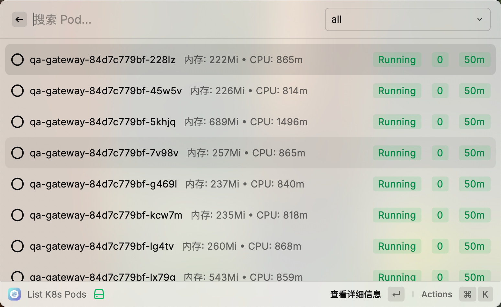

# Easy Kubelet

<p align="center">
  
</p>

一个简单易用的 Raycast 扩展，专为 Kubernetes 使用者设计，用于高效监控和管理集群中的 Pod。

## ✨ 功能特点

- 🔍 实时查看 Pod 列表及详细信息（基于 `kubectl get pods -n <namespace> -o wide`）
- 📊 监控 Pod 资源使用情况（基于 `kubectl top pod -n <namespace>`）
- 🏷️ 通过 Pod 名称前缀智能分类，快速定位相关服务
- 🎨 状态颜色标识，直观了解 Pod 健康状况
- 📝 一键复制 Pod 名称和 IP 地址
- 🔧 灵活配置，支持自定义命名空间和 kubectl 路径

## 🛠️ 安装方法

### 方法一：从 Raycast Store 安装

1. 在 Raycast 中打开命令面板
2. 搜索 "Store"
3. 在 Raycast Store 中搜索 "Easy Kubelet"
4. 点击安装

### 方法二：手动安装

1. 克隆本仓库
```bash
git clone https://github.com/yourusername/easy-kubelet.git
```

2. 安装依赖
```bash
cd easy-kubelet
npm install
```

3. 在开发模式下运行
```bash
npm run dev
```

## ⚙️ 配置选项

在 Raycast 的扩展设置中配置以下选项：

| 配置项 | 说明 | 默认值 |
|-------|------|-------|
| Kubernetes Namespace | 要查询的命名空间 |  |
| kubectl 路径 | kubectl 命令的完整路径 | (系统 PATH 中的 kubectl) |

## 🚀 使用方法

1. 在 Raycast 中输入 "k" 快速启动扩展
2. 使用顶部下拉菜单按 Pod 前缀分类查看
3. 使用搜索框快速筛选特定 Pod
4. 通过颜色标签快速识别 Pod 状态：
   - 🟢 绿色：Running
   - 🟡 黄色：Pending
   - 🔴 红色：Failed/Error
   - 🔵 蓝色：Succeeded
5. 选择 Pod 点击操作来复制名称、IP 或查看详细信息

## 📋 需求条件

- Raycast v1.50.0 或更高版本
- 已安装 kubectl 命令行工具
- 已配置 kubectl 可访问的 Kubernetes 集群

## 🤝 贡献指南

欢迎提交 Pull Request 或创建 Issue 来帮助改进此扩展！

## 📄 许可证

本项目采用 MIT 许可证 - 详情请参阅 [LICENSE](LICENSE) 文件。