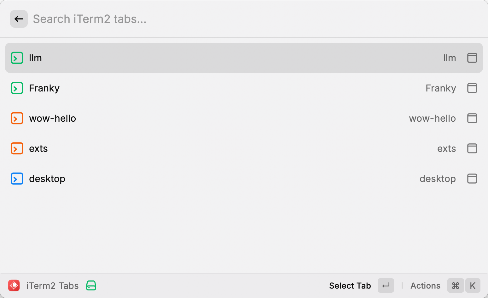

# iTerm2 Tabs Extension for Raycast

A powerful Raycast extension that helps you manage and switch between iTerm2 tabs efficiently.

## Features

- 🔍 Quick search through all iTerm2 tabs
- 🎨 Color-coded tabs for easy identification
- 🚀 Instant tab switching
- 👁️ Rich visual interface with process information
- ⌨️ Keyboard-first navigation

## Prerequisites

- macOS
- [Raycast](https://raycast.com/) installed
- [iTerm2](https://iterm2.com/) installed

## Installation

1. Open Raycast
2. Search for "Store"
3. Find "iTerm2 Tabs"
4. Click Install

## Usage

1. Open Raycast with your preferred shortcut
2. Type "iterm" or "tabs" to find the extension
3. Press Enter to see all your iTerm2 tabs
4. Search or browse through your tabs
5. Press Enter on any tab to switch to it

## Key Features

### Tab Management
- Lists all open iTerm2 tabs across all windows
- Shows tab titles and running processes
- Provides instant switching between tabs

### Search and Filter
- Real-time search through tab titles
- Keyboard-optimized navigation
- Smart filtering based on process names

### Visual Feedback
- Color-coded tabs for easy identification
- Terminal icons with dynamic colors
- Clear success/failure notifications

## Development

This extension is built using:
- React
- TypeScript
- Raycast API
- AppleScript for iTerm2 integration

## Error Handling

The extension includes comprehensive error handling for common scenarios:
- No iTerm2 tabs found
- iTerm2 not running
- AppleScript execution errors
- JSON parsing errors

## Contributing

Feel free to open issues or submit pull requests for any improvements you'd like to see!

## License

MIT License - feel free to use and modify as needed.

---

Built with ❤️ for Raycast and iTerm2 users